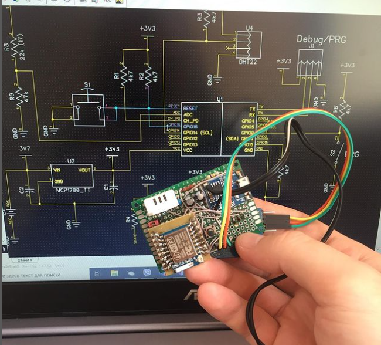
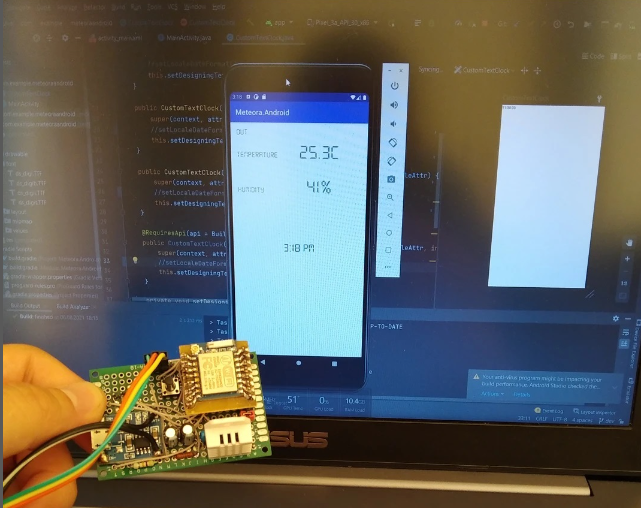

# WiFiOutdoorSensor

WiFiOutdoorSensor is a wireless outdoor temperature and humidity monitoring system. It uses ESP8266 for network communication, BMP180 for barometric pressure measurements, and DHT-22 for temperature and humidity data. Powered by a battery, it's designed to be low-power and can be accessed via a web server, an Android application, or a Windows desktop application.

---

## Features

- **Wireless Communication**: Uses ESP8266 for wireless data transfer.
- **Sensors**: 
  - BMP180: Measures atmospheric pressure.
  - DHT-22: Monitors outdoor temperature and humidity.
- **Battery Power Management**: Optimized for prolonged battery life.
- **Web Server with Interface**: Access sensor data remotely via any web browser.
- **Android Application**: Conveniently view sensor data on-the-go.
- **Windows Desktop Application**: Access the sensor data from your PC.

---

## Table of Contents

1. [Components](#components)
2. [Setup Guide](#setup-guide)
3. [Web Interface](#web-interface)
4. [Android App](#android-app)
5. [Windows Desktop App](#windows-desktop-app)

## UI Layouts
  
  
  
## Hardware side

  

---

## Components

- **ESP8266**: Provides Wi-Fi capabilities for remote access.
- **BMP180**: Pressure sensor that is accurate and easy-to-use.
- **DHT-22**: Known for its stability and accuracy for temperature and humidity readings.
- **Battery**: Provides power to the system, optimized for low power consumption.

---

## Setup Guide

1. **Hardware Setup**:
    - Connect BMP180 and DHT-22 to ESP8266 following the circuit diagram provided in `docs/circuit_diagram.pdf`.
    - Attach the battery and ensure connections are secure.

2. **Software Configuration**:
    - Flash the provided firmware to ESP8266.
    - Configure Wi-Fi settings by editing the `wifi_config.h` file.
    - Deploy the web server files to a hosting server or locally on ESP8266.

---

## Web Interface

1. Navigate to the IP address assigned to your ESP8266.
2. You'll be presented with a simple dashboard showing the temperature, humidity, and atmospheric pressure readings.
3. Data updates in real-time, and you can also access historical data graphs.

---

## Android App

1. Install the `WiFiOutdoorSensor.apk` from the provided directory or Play Store.
2. Open the app and configure the IP address of your ESP8266 module.
3. Access real-time and historical data anytime, anywhere.

---

## Windows Desktop App

1. Download and install `WiFiOutdoorSensorInstaller.exe`.
2. Launch the application and navigate to `Settings`.
3. Input the IP address of your ESP8266 module and save.
4. View real-time data in a convenient desktop widget.

---

## Contribution

Feel free to contribute to this project. Fork the repository, make your changes, and submit a pull request.

---

## License

This project is licensed under the MIT License. See the `LICENSE` file for details.

---

## Support

For issues or feature requests, please open an issue on our GitHub repository.

---

We hope WiFiOutdoorSensor makes monitoring outdoor conditions convenient for you!
